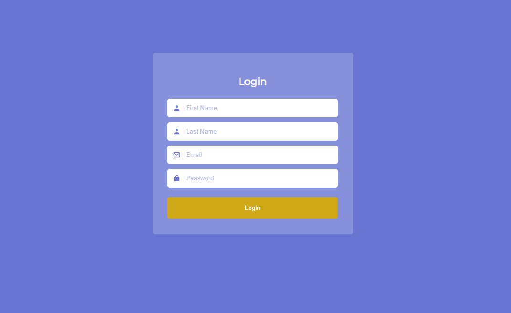

# A Simple Login Page

This application is a very simple login page designed for desktop application.  
This was basically a test project I took for a day for a company I was applying as a front-end role.

If I were to redo or improve this, I would have applied more effort to improving its mobile responsiveness.  



### Required Setup

Create file `.env` file then add variable:

```
# Use ENV=prod for production
ENV=dev
PORT=8000
```

### Running docker in daemon

Note: `docker` && `docker-compose` should be installed on your machine.
Also, set `ENV=prod` from `.env` file.

```
docker-compose up --build -d
```

### Build nginx dockerfile manually

```
docker build -t client-nginx . --file config/nginx/Dockerfile
```

### Running application in development

```
npm run dev
```

### Running application for production using npm

```
npm run build && npm run start
```
